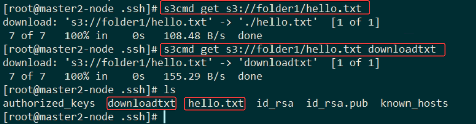
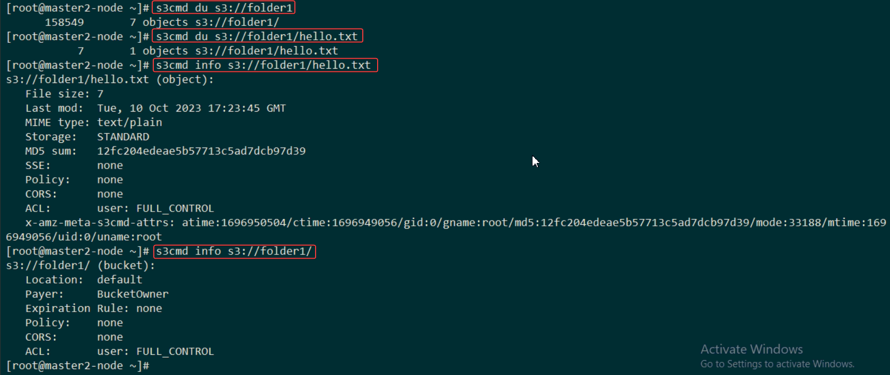

# Managing buckets
Create new bucket
```console
s3cmd mb s3://example-bucket
s3cmd ls
```
If you want to remove a certain bucket, you can delete it by using the following command.
```console
s3cmd rb s3://example-bucket
```


# Managing files
Put object
```console
s3cmd put ~/example.txt s3://example-bucket
```
List objects
```console
s3cmd ls s3://example-bucket
```
Get object (download locally)
```console
s3cmd get s3://example-bucket/example.txt ~/example2.txt
```


Copy object
You can also copy files between buckets within the same Object Storage without having to save the object elsewhere.
```console
s3cmd cp s3://BUCKET1/OBJECT1 s3://BUCKET2/OBJECT2
```
Move object
The following command will move the example.txt to the new bucket and rename it to example2.txt.
```console
s3cmd mv s3://example-bucket/example.txt s3://new-bucket/example2.txt
```
Compress object
Compress File Before Upload:
```console
cat foobar | gzip -9 | s3cmd put - s3://linuxconfigorg/foobar.gz
```
Compress Directory Before upload:
```console
tar cz dir1/ | gzip -9 | s3cmd put - s3://linuxconfigorg/dir1.tar.gz
```


List all objects
```console
s3cmd la
```
Delete object
```console
s3cmd rm s3://BUCKET/OBJECT
```
Sync a Local Directory:
```console
s3cmd sync dir1/ s3://linux/
```


# Other operations

Disk usage
Provides information about storage usage by bucket
```console
s3cmd du [s3://BUCKET[/PREFIX]]
```

Bucket and file info
Used to get information about buckets or files
```console
s3cmd info s3://BUCKET[/OBJECT]
```

Modify metadata
Can be used to change the object metadata
```console
s3cmd modify s3://BUCKET1/OBJECT
```


Check the full list of supported Object Storage operations by using the help command.
```console
s3cmd --help
```

# Reference:
https://upcloud.com/resources/tutorials/s3cmd-object-storage
https://www.oreilly.com/library/view/ceph-cookbook/9781788391061/b7a149e4-0151-40ec-bbc8-a2c881c11614.xhtml