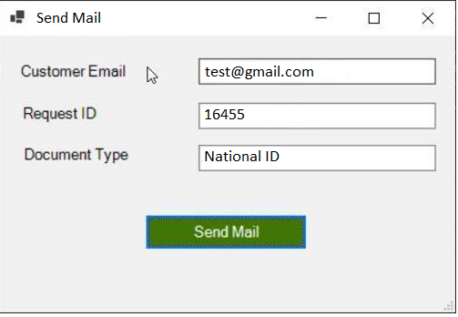

**using GUI for sending mail**
as the below screenshot scipt will take the user input as he's insert and put in in the body and also take the mail and put it in -To
$Body="Dear your id is  $idtxt and the document type is $Doctypetxt "
