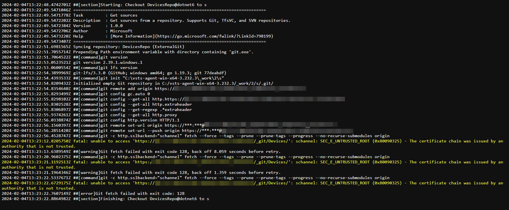
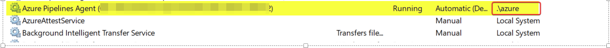

# The issue:
- Could'nt established connection with tfs to check out code due to tls issue


# The Solve:
- this git command should solve this issue but , **but you should to run this command by the user which is owned the azure agent services** as the shown in image below:
```console
git config --global http.sslVerify false
git config --global http.sslBackend schannel sho
```
