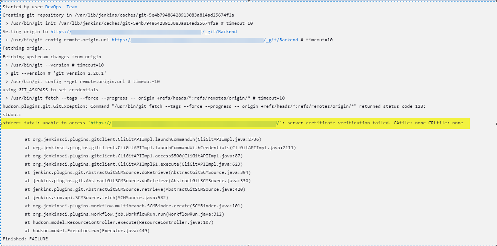

# The Issue
- problem with the Git operation in a Jenkins pipeline. The issue is related to server certificate verification failure.
- The Jenkins job is trying to create a Git repository.
- It's setting the origin URL and attempting to fetch changes from the remote repository.
- stderr: fatal: unable to access 'https://<repository_url>': server certificate verification failed. CAfile: none CRLfile: none
- The error occurs during the git fetch command.
- The failure is due to the server certificate not being verified because the CAfile (Certificate Authority file) and CRLfile (Certificate Revocation List file) are not specified or found.
- The root cause of the issue is that the Git client on the Jenkins server cannot verify the SSL certificate of the remote Git server


# The Solution:
Export certificate to add it in the trusted certificate in the jenkins server by using the below command:
```console
openssl s_client -showcerts -connect  <repository_url>:443
```

```markdown
Result:
CONNECTED(00000248)
depth=1 DC = com, DC = yourcompany, CN = yourissuer
verify error:num=20:unable to get local issuer certificate
---
Certificate chain
 0 s:/CN=domain.com
   i:/DC=com/DC=yourcompany/CN=yourissuer
-----BEGIN CERTIFICATE-----#**put this in the file with name as example cert1.crt**
lRKLCt+W4LIoRLPlRKLCt+W4LIoRLPlRKLCt+W4LIoRLPlRKLCt+W4LIoRLPasas
lRKLCt+W4LIoRLPlRKLCt+W4LIoRLPlRKLCt+W4LIoRLPlRKLCt+W4LIoRLPasas
lRKLCt+W4LIoRLPlRKLCt+W4LIoRLPlRKLCt+W4LIoRLPlRKLCt+W4LIoRLPasas
lRKLCt+W4LIoRLPlRKLCt+W4LIoRLPlRKLCt+W4LIoRLPlRKLCt+W4LIoRLPasas
lRKLCt+W4LIoRLPlRKLCt+W4LIoRLPlRKLCt+W4LIoRLPlRKLCt+W4LIoRLPasas
lRKLCt+W4LIoRLPlRKLCt+W4LIoRLPlRKLCt+W4LIoRLPlRKLCt+W4LIoRLPasas
lRKLCt+W4LIoRLPlRKLCt+W4LIoRLPlRKLCt+W4LIoRLPlRKLCt+W4LIoRLPasas
lRKLCt+W4LIoRLPlRKLCt+W4LIoRLPlRKLCt+W4LIoRLPlRKLCt+W4LIoRLPasas
lRKLCt+W4LIoRLPlRKLCt+W4LIoRLPlRKLCt+W4LIoRLPlRKLCt+W4LIoRLPasas
lRKLCt+W4LIoRLPlRKLCt+W4LIoRLPlRKLCt+W4LIoRLPlRKLCt+W4LIoRLPasas
lRKLCt+W4LIoRLPlRKLCt+W4LIoRLPlRKLCt+W4LIoRLPlRKLCt+W4LIoRLPasas
lRKLCt+W4LIoRLPlRKLCt+W4LIoRLPlRKLCt+W4LIoRLPlRKLCt+W4LIoRLPasas
lRKLCt+W4LIoRLPlRKLCt+W4LIoRLPlRKLCt+W4LIoRLPlRKLCt+W4LIoRLPasas
lRKLCt+W4LIoRLPlRKLCt+W4LIoRLPlRKLCt+W4LIoRLPlRKLCt+W4LIoRLPasas
lRKLCt+W4LIoRLPlRKLCt+W4LIoRLPlRKLCt+W4LIoRLPlRKLCt+W4LIoRLPasas
lRKLCt+W4LIoRLPlRKLCt+W4LIoRLPlRKLCt+W4LIoRLPlRKLCt+W4LIoRLPasas
lRKLCt+W4LIoRLPlRKLCt+W4LIoRLPlRKLCt+W4LIoRLPlRKLCt+W4LIoRLPasas
lRKLCt+W4LIoRLPlRKLCt+W4LIoRLPlRKLCt+W4LIoRLPlRKLCt+W4LIoRLPasas
lRKLCt+W4LIoRLPlRKLCt+W4LIoRLPlRKLCt+W4LIoRLPlRKLCt+W4LIoRLPasas
lRKLCt+W4LIoRLPlRKLCt+W4LIoRLPlRKLCt+W4LIoRLPlRKLCt+W4LIoRLPasas
lRKLCt+W4LIoRLPlRKLCt+W4LIoRLPlRKLCt+W4LIoRLPlRKLCt+W4LIoRLPasas
lRKLCt+W4LIoRLPlRKLCt+W4LIoRLPlRKLCt+W4LIoRLPlRKLCt+W4LIoRLPasas
lRKLCt+W4LIoRLPlRKLCt+W4LIoRLPlRKLCt+W4LIoRLPlRKLCt+W4LIoRLPasas
lRKLCt+W4LIoRLPlRKLCt+W4LIoRLPlRKLCt+W4LIoRLPlRKLCt+W4LIoRLPasas
lRKLCt+W4LIoRLPlRKLCt+W4LIoRLPlRKLCt+W4LIoRLPlRKLCt+W4LIoRLPasas
lRKLCt+W4LIoRLPlRKLCt+W4LIoRLPlRKLCt+W4LIoRLPlRKLCt+W4LIoRLPasas
lRKLCt+W4LIoRLPlRKLCt+W4LIoRLPlRKLCt+W4LIoRLPlRKLCt+W4LIoRLPasas
lRKLCt+W4LIoRLPlRKLCt+W4LIoRLPlRKLCt+W4LIoRLPlRKLCt+W4LIoRLPasas
lRKLCt+W4LIoRLPlRKLCt+W4LIoRLPlRKLCt+W4LIoRLPlRKLCt+W4LIoRLPasas
lRKLCt+W4LIoRLPlRKLCt+W4LIoRLPlRKLCt+W4LIoRLPlRKLCt+W4LIoRLPasas
lRKLCt+W4LIoRLPlRKLCt+W4LIoRLPlRKLCt+W4LIoRLPlRKLCt+W4LIoRLP==
-----END CERTIFICATE-----
 1 s:/DC=com/DC=yourcompany/CN=yourissuer
   i:/CN=ROOT-CA
-----BEGIN CERTIFICATE-----#**put this in the file with name as example cert2.crt**
lRKLCt+W4LIoRLPlRKLCt+W4LIoRLPlRKLCt+W4LIoRLPlRKLCt+W4LIoRLPasas
lRKLCt+W4LIoRLPlRKLCt+W4LIoRLPlRKLCt+W4LIoRLPlRKLCt+W4LIoRLPasas
lRKLCt+W4LIoRLPlRKLCt+W4LIoRLPlRKLCt+W4LIoRLPlRKLCt+W4LIoRLPasas
lRKLCt+W4LIoRLPlRKLCt+W4LIoRLPlRKLCt+W4LIoRLPlRKLCt+W4LIoRLPasas
lRKLCt+W4LIoRLPlRKLCt+W4LIoRLPlRKLCt+W4LIoRLPlRKLCt+W4LIoRLPasas
lRKLCt+W4LIoRLPlRKLCt+W4LIoRLPlRKLCt+W4LIoRLPlRKLCt+W4LIoRLPasas
lRKLCt+W4LIoRLPlRKLCt+W4LIoRLPlRKLCt+W4LIoRLPlRKLCt+W4LIoRLPasas
lRKLCt+W4LIoRLPlRKLCt+W4LIoRLPlRKLCt+W4LIoRLPlRKLCt+W4LIoRLPasas
lRKLCt+W4LIoRLPlRKLCt+W4LIoRLPlRKLCt+W4LIoRLPlRKLCt+W4LIoRLPasas
lRKLCt+W4LIoRLPlRKLCt+W4LIoRLPlRKLCt+W4LIoRLPlRKLCt+W4LIoRLPasda
lRKLCt+W4LIoRLPlRKLCt+W4LIoRLPlRKLCt+W4LIoRLPlRKLCt+W4LIoRLPasas
lRKLCt+W4LIoRLPlRKLCt+W4LIoRLPlRKLCt+W4LIoRLPlRKLCt+W4LIoRLP=
-----END CERTIFICATE-----
---
Server certificate
subject=/CN=yourdomain.com
issuer=/DC=com/DC=yourcomany/CN=yourissuer
---
No client certificate CA names sent
Peer signing digest: SHA256
Server Temp Key: ECDH, P-384, 384 bits
---
SSL handshake has read 3048 bytes and written 466 bytes
---
New, TLSv1/SSLv3, Cipher is ECDHE-RSA-AES256-GCM-SHA384
Server public key is 2048 bit
Secure Renegotiation IS supported
Compression: NONE
Expansion: NONE
No ALPN negotiated
SSL-Session:
    Protocol  : TLSv1.2
    Cipher    : ECDHE-RSA-AES256-GCM-SHA384
    Session-ID: 18070000AC54C1232E7D321CD68DFF158B9906A4C4972BA22C8C9E76FF9BC9CD
    Session-ID-ctx:
    Master-Key: 0DC4BCB384C501613169975CF7F0D399A72C61E6F1919072D7B47B5E049CDE6C3F3318A52A95A8963D5DBE3F288F5727
    Key-Arg   : None
    PSK identity: None
    PSK identity hint: None
    SRP username: None
    Start Time: 1706555569
    Timeout   : 300 (sec)
    Verify return code: 20 (unable to get local issuer certificate)
------------------------------------------------------------------------------------------------------------------------
```

- Add these files (cert1.crt, crt2.crt) to this path our case it was in ubuntu 19.X : **/usr/local/share/ca-certificates**
Then run : 
```console
sudo update-ca-certificates
```
**this command install crt as pem then stored it in /etc/ssl/certs and this will solve the issue**

# Installing a certificate in PEM form
Assuming a PEM-formatted root CA certificate is in local-ca.crt, follow the steps below to install it.
- Note: It is important to have the .crt extension on the file, otherwise it will not be processed.
```console
sudo apt-get install -y ca-certificates
sudo cp local-ca.crt /usr/local/share/ca-certificates
sudo update-ca-certificates
sudo update-ca-certificates -f --fresh
```

